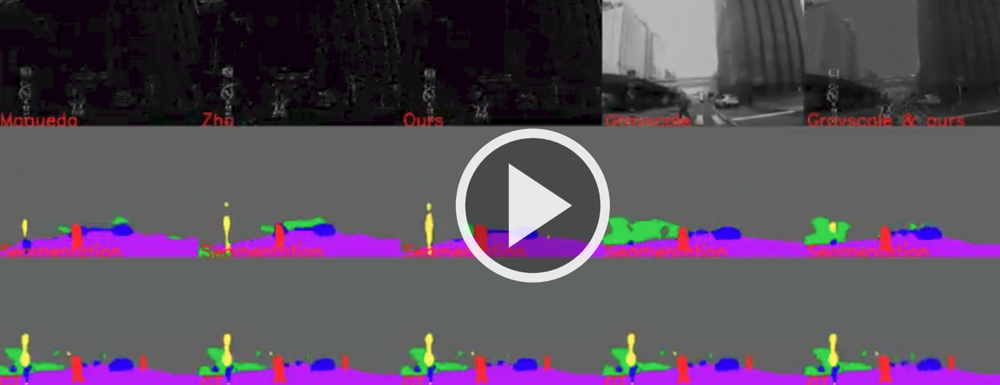

# Ev-SegNet

[](https://youtu.be/YQXBjWUSiaA)

This work proses an approach for learning semantic segmentation from only event-based information (event-based cameras).

For more details, here is the [Paper](https://drive.google.com/file/d/1eTX6GXy5qP9I4PWdD4MkRRbEtfg65XCr/view?usp=sharing)

**[This repository contains the basic and the core implementation and data from the paper. It will be updated with more detail with the time]**

# Requirements
* Python 2.7+
* Tensorflow 1.11
* Opencv
* Keras
* Imgaug
* Sklearn


## Citing Ev-SegNet 

If you find EV-SegNet useful in your research, please consider citing:
``` 
@inproceedings{alonso2019EvSegNet,
  title={EV-SegNet: Semantic Segmentation for Event-based Cameras},
  author={Alonso, I{\~n}igo and Murillo, Ana C},
  booktitle={IEEE International Conference on Computer Vision and Pattern Recognition Workshops (CVPRW)},
  year={2019}
}
```

## Dataset
Our dataset is a subset of the [DDD17: DAVIS Driving Dataset](http://sensors.ini.uzh.ch/news_page/DDD17.html). This original dataset do not provide any semantic segmentation label, we provide them as well as some modification of the event images.


[Download it here](https://drive.google.com/open?id=1Ug6iZc7WYQWCklxwcemCeyw3CPyuuxJf)

The semantic segmentation labels of the data are:
flat:0, construction+sky:1, object:2,  nature:3,  human:4, vehicle:5, ignore_labels:255


## Replicate results
For testing the pre-trained model just execute:
```
python train_eager.py --epochs 0
```

## Train from scratch


```
python train_eager.py --epochs 500 --dataset path_to_dataset  --model_path path_to_model  --batch_size 8
```

Where [path_to_dataset] is the path to the downloaded dataset (uncompressed) and [path_to_model] is the path where the weights are going to be saved

## Get new labels

First, download [this folder](https://drive.google.com/drive/folders/1NjTGAoSCpYw_l89l1BdulJi0B_qIIiin?usp=sharing) and copy it into the weights folder of this repository (so that you have weights/cityscapes_grasycale folder).

Then...
 
